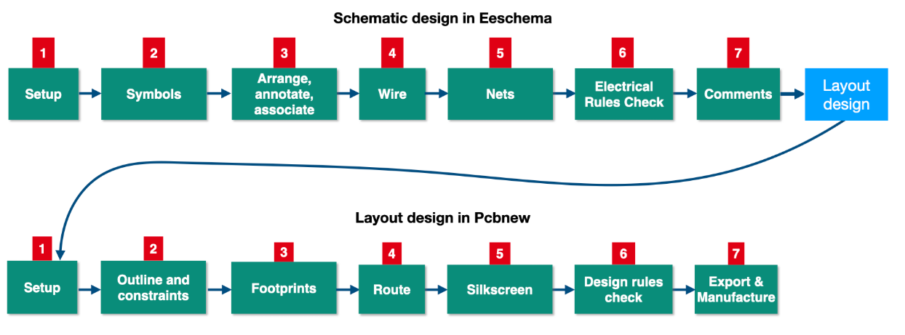
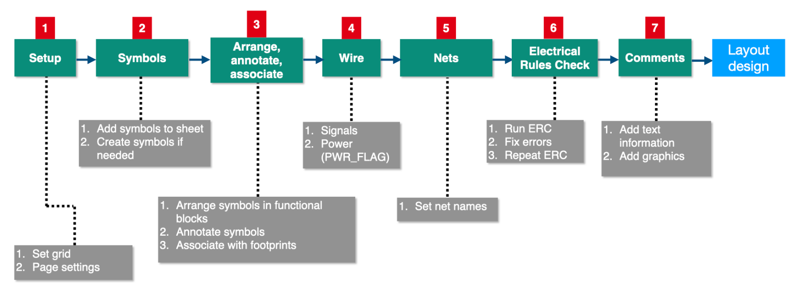
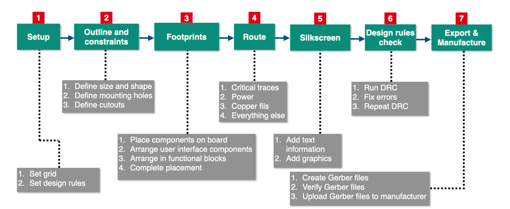

# Design Workflows  

PCB design workflows systematize the transition from conceptual circuit diagrams to manufacturable boards, ensuring logical integrity, electrical compliance, and physical feasibility. Two interdependent workflows govern this process: **Schematic Design** (logical representation) and **PCB Layout** (physical realization). KiCad’s Eeschema and Pcbnew tools formalize these stages, enabling designers to iteratively refine designs while adhering to industry standards.  

## Schematic Design Workflow  

### Purpose and Scope  
The schematic workflow defines circuit functionality through standardized symbols and interconnections, serving as the authoritative reference for layout and verification.  

### Key Steps  
1. **Project Initialization**  
   - Create a KiCad project (*.kicad_pro*) with dedicated directories for schematics, libraries, and outputs.  
   - Configure global settings (*Preferences > Symbol Libraries*) to ensure access to required component repositories.  

2. **Component Selection**  
   - Source symbols from KiCad’s built-in libraries (e.g., `Device`, `Power`) or custom libraries.  
   - Critical components:  
     - **Passive/Active Devices:** Resistors, capacitors, ICs.  
     - **Power Sources:** Batteries, voltage regulators.  
     - **Connectors/Interfaces:** Headers, switches.  

3. **Component Placement**  
   - Arrange symbols to reflect signal flow (e.g., power input → conditioning → load → ground).  
   - Align components on a 50 mil grid (*View > Grid Settings*) for consistency.  

4. **Wiring and Connectivity**  
   - Establish electrical connections using wires (*Place Wire*, `W`).  
   - Define power nets (e.g., `+3V3`, `GND`) with global labels (*Place Global Label*, `L`).  
   - Use power flags (*Place Power Flag*) to suppress ERC warnings for unconnected supplies.  

5. **Net Naming**  
   - Assign descriptive net names (e.g., `LED_ANODE`, `SW_SIGNAL`) to simplify layout routing and debugging.  

6. **Design Validation (ERC)**  
   - Execute Electrical Rule Check (*Inspect > ERC*) to detect:  
     - Unconnected pins or conflicting outputs.  
     - Missing power sources or incorrect net assignments.  
   - Resolve errors by revising connectivity or adding suppression directives.  

7. **Export and Preparation for Layout**  
   - Generate netlist (*Tools > Generate Netlist*) to map logical connections to physical footprints.  
   - Annotate components (*Tools > Annotate*) with unique reference designators (R1, C2).  

---

## PCB Layout Workflow  

### Purpose and Scope  
The layout workflow translates schematic logic into a physical board, balancing electrical performance, thermal management, and manufacturability.  

### Key Steps  
1. **Import Schematic Data**  
   - Load netlist (*File > Import Netlist*) or synchronize via KiCad’s Schematic ↔ Layout synchronization.  
   - Validate footprint associations (*Tools > Update PCB from Schematic*).  

2. **Footprint Assignment**  
   - Link schematic symbols to physical footprints (e.g., `Resistor_SMD:R_0805`, `LED:LED_THT`).  
   - Verify footprint dimensions, pad sizes, and 3D models (*View > 3D Viewer*).  

3. **Component Placement**  
   - Prioritize critical components (e.g., connectors, ICs) based on signal integrity or mechanical constraints.  
   - Group related components (e.g., power supply section, analog inputs) to minimize trace lengths.  

4. **Routing**  
   - Route high-priority signals (e.g., high-speed traces, power paths) first using manual or autorouter tools.  
   - Define copper pours (*Add Filled Zone*) for power/ground planes to reduce noise and impedance.  

5. **Design Rule Compliance**  
   - Configure design rules (*File > Board Setup > Design Rules*) for:  
     - Trace width (e.g., 0.3 mm for signals, 1.0 mm for power).  
     - Clearance (e.g., 0.2 mm between traces, 0.5 mm from board edge).  
     - Via styles (through-hole vs. microvia).  

6. **Design Verification (DRC)**  
   - Run Design Rule Check (*Inspect > DRC*) to identify:  
     - Short circuits, insufficient clearances, or unconnected nets.  
     - Footprint overlaps or misplaced vias.  
   - Iterate placement/routing until all violations are resolved.  

7. **Manufacturing Preparation**  
   - Generate Gerber files (*File > Fabrication Outputs > Gerber*) for each layer (copper, solder mask, silkscreen).  
   - Export drill files (*File > Fabrication Outputs > Drill Files*) in Excellon format.  
   - Validate outputs using Gerber viewers (e.g., KiCad’s GerbView) or manufacturer design rule checks.  

---

## Iterative Workflow Dynamics  
Design workflows are inherently cyclical, requiring revisions to earlier stages based on validation outcomes:  
- **Schematic Revisions:** ERC errors (e.g., unpowered nets) may necessitate revisiting component placement or wiring.  
- **Layout Revisions:** DRC failures (e.g., trace spacing violations) may require footprint rearrangement or schematic net adjustments.  
- **Cross-Workflow Synchronization:** Changes in schematic symbols (e.g., pin swaps) propagate to layout via netlist re-import.  

---

## Workflow Simplification Strategy  
### For Beginners  
- **Linear Progression:** Execute workflows sequentially (schematic → layout) to build foundational skills.  
- **Guided Validation:** Rely on ERC/DRC tools to flag errors without premature optimization.  

### For Advanced Users  
- **Concurrent Refinement:** Modify schematics and layouts in tandem to address signal integrity or EMI constraints.  
- **Design Reuse:** Leverage hierarchical sheets and custom design rules for multi-board or high-density projects.  

---

## Expected Competencies  
By mastering these workflows, designers will:  
- **Navigate KiCad Tools Efficiently:** Proficiently utilize Eeschema and Pcbnew for end-to-end PCB development.  
- **Implement Robust Validation:** Resolve ERC/DRC issues through systematic debugging.  
- **Optimize for Manufacturability:** Generate industry-standard outputs (Gerber, drill files) compatible with PCB fabrication.  

---

## Transition to Advanced Design  
The structured workflows provide a foundation for tackling complex projects, such as:  
- **High-Speed Digital Design:** Impedance-controlled routing, length matching.  
- **Mixed-Signal Layout:** Ground partitioning, noise isolation.  
- **Thermal Management:** Heat sink integration, thermal relief patterns.  

This methodological rigor ensures designs meet functional, reliability, and production requirements at scale.
