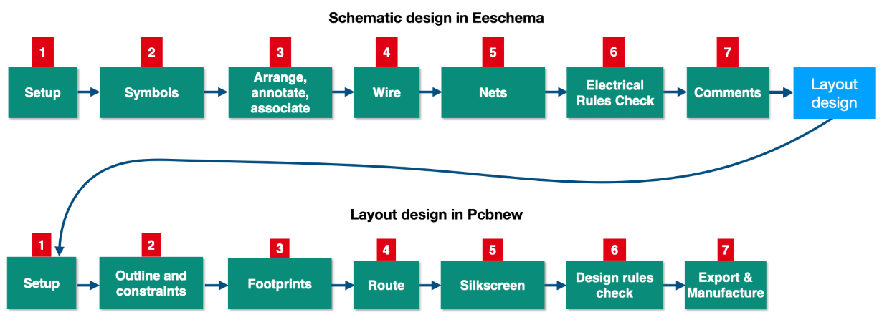

# Quick Introduction to the Design Workflows

The design workflows in PCB design are integral to the successful development of a functional circuit board. This section provides a concise overview of the two principal workflows involved in the process: the **Schematic Design Workflow** and the **PCB Layout Workflow**. These workflows represent the logical progression from conceptual design to a manufacturable printed circuit board.

---

## **Overview of the Workflows**

### **Schematic Design Workflow**
The schematic design workflow involves the logical construction of a circuit diagram using KiCad’s Eeschema tool. This phase captures the functional intent of the design and prepares it for physical realization. The workflow encompasses the following seven steps:
1. **Project Initialization**: Creation and configuration of a new KiCad project.
2. **Component Selection**: Identifying and importing symbols from the built-in or custom libraries.
3. **Component Placement**: Arranging symbols on the canvas for logical clarity and efficient connectivity.
4. **Wiring and Connectivity**: Establishing signal and power connections using wires, power flags, and labels.
5. **Net Naming**: Assigning meaningful names to nets for clarity and facilitating error-free layout design.
6. **Design Validation**: Running Electrical Rule Check (ERC) to ensure the schematic is error-free and adheres to design rules.
7. **Export and Preparation for Layout**: Generating the necessary files, such as the netlist, to transition to the layout phase.

## **PCB Layout Workflow**
The PCB layout workflow follows the schematic design phase, transforming the logical representation into a physical arrangement of components and traces. This phase is conducted in KiCad’s Pcbnew tool and also comprises seven steps:
1. **Import Schematic Data**: Loading the netlist or directly synchronizing the schematic to the PCB layout.
2. **Footprint Assignment**: Associating each schematic symbol with an appropriate physical footprint.
3. **Component Placement**: Arranging footprints on the PCB canvas to optimize performance and manufacturability.
4. **Routing**: Creating signal traces and power planes that connect components as defined in the schematic.
5. **Design Rule Compliance**: Ensuring the layout adheres to predefined constraints, such as trace width and spacing.
6. **Design Verification**: Performing Design Rule Check (DRC) and verifying connectivity.
7. **Manufacturing Preparation**: Generating Gerber files and other outputs necessary for production.

---

### **Iterative Nature of Workflows**

While the workflows are presented as linear sequences, it is critical to recognize their iterative nature. For instance:
- During **step 6** of the schematic design workflow (ERC), errors such as incorrect or missing connections may necessitate revisiting earlier steps like wiring (step 4).
- In the PCB layout workflow, a Design Rule Check (DRC) performed in **step 6** may reveal issues requiring modifications to the schematic, such as reassigning net names or reconfiguring the circuit logic.

This iterative process is a natural part of PCB design, ensuring robust and error-free outcomes.

---

### **Purpose of this Overview**
The intent of this overview is to familiarize you with the two core workflows, enabling you to navigate through them effectively as you progress in this course. While detailed explanations of individual steps will follow in subsequent lectures, this summary serves to provide a structural framework, ensuring that key concepts and terminologies are not unfamiliar when encountered later.

---

## **Workflow Simplification for Learning**
For beginners, it is beneficial to initially approach these workflows as linear processes. This simplification helps to streamline learning by reducing complexity and focusing on the completion of tasks in a structured manner. Advanced users can appreciate the interconnectedness and flexibility of these workflows, leveraging iterative refinement for more sophisticated designs.

By understanding the fundamental structure and flow of these workflows, you are now prepared to delve into each step in greater depth as outlined in the upcoming sections of the course. The following lectures will provide detailed, step-by-step instructions to ensure a thorough grasp of the schematic design and PCB layout processes.